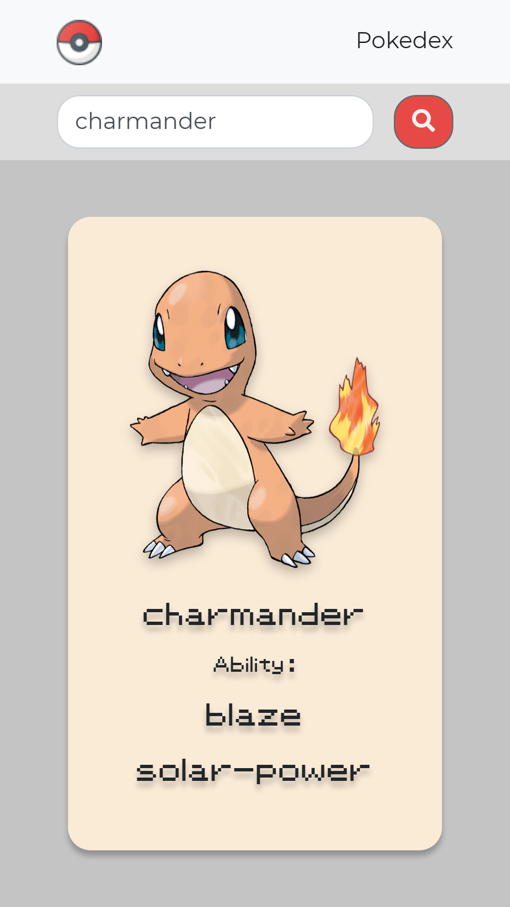

# Pokedex

Pokedex is to display the skills of the searched pokemon.

Link [👨‍💻](https://m-pokedex.netlify.app/)

## Usage

Search name of a pokemon and his picture with skills will be displayed below in a card.

## Resources used

- Create react app [🔗](https://reactjs.org/docs/create-a-new-react-app.html)
- PokéAPI [🔗](https://pokeapi.co/)
- Bootstrap [🔗](https://getbootstrap.com/)
- FontAwesome [🔗](https://fontawesome.com/)
- Gsap Animation [🔗](https://greensock.com/gsap/)

## Learning

- Fetch API
- Difference b/w Asynchronous and Synchronous

## License

[MIT](https://choosealicense.com/licenses/mit/)
